<a href="https://portfolio.tanishq.foo">
  <picture>
    <source media="(prefers-color-scheme: dark)" srcset="./assets/banner-dark.svg" />
    
  </picture>
</a>

 

Software engineer in Bangalore. At **[Talview](https://www.talview.com)** I've been the most active contributor to our frontend monorepo over the last year — building product UIs, offline-first data layers and embeddable apps, and leading the migration of our legacy systems to a monorepo. Outside work I ship developer tools and full-stack side projects.

**[Portfolio](https://portfolio.tanishq.foo)** &nbsp;·&nbsp; **[Résumé](https://portfolio.tanishq.foo/resume)** &nbsp;·&nbsp; **[LinkedIn](https://www.linkedin.com/in/tanishq-khandelwal-19688321b)** &nbsp;·&nbsp; **[tanishqkhandelwal2019@gmail.com](mailto:tanishqkhandelwal2019@gmail.com)**

---

### `[01]` Toolbox

| | |
|:--|:--|
| **Languages** | TypeScript · JavaScript · Rust · Python · Java · C++ · SQL |
| **Frontend** | React · Next.js · Tailwind CSS · Framer Motion · Chrome Extensions · Figma |
| **Backend & data** | Node.js · Express · Hono · PostgreSQL · MongoDB · MySQL · Drizzle ORM · GraphQL · RxDB |
| **Tooling** | Git · GitHub Actions · Docker · Vite · Vercel · Linux |
