<a href="https://portfolio.tanishq.foo">
  <picture>
    <source media="(prefers-color-scheme: dark)" srcset="./assets/banner-dark.svg" />
    
  </picture>
</a>

 

**Full-stack, end to end.** I take ideas from a blank Figma frame to a shipped product — the interface, the API, the database, the release pipeline, and the product calls in between. Pixel-level UI one day, a Rust CLI or a Postgres schema the next. If it needs building, I'd rather own the whole thing than hand it off halfway.

`design` → `frontend` → `backend` → `data` → `ship` — I do all of it.

**[Portfolio](https://portfolio.tanishq.foo)** &nbsp;·&nbsp; **[Résumé](https://portfolio.tanishq.foo/resume)** &nbsp;·&nbsp; **[LinkedIn](https://www.linkedin.com/in/tanishq-khandelwal-19688321b)** &nbsp;·&nbsp; **[tanishqkhandelwal2019@gmail.com](mailto:tanishqkhandelwal2019@gmail.com)**

---

<picture>
  <source media="(prefers-color-scheme: dark)" srcset="./assets/scan-dark.svg" />
  
</picture>

### `[02]` Toolbox

| | |
|:--|:--|
| **Languages** | TypeScript · JavaScript · Rust · Python · Java · C++ · SQL |
| **Frontend** | React · Next.js · Tailwind CSS · Framer Motion · Chrome Extensions · Figma |
| **Backend & data** | Node.js · Express · Hono · PostgreSQL · MongoDB · MySQL · Drizzle ORM · GraphQL · RxDB |
| **Tooling** | Git · GitHub Actions · Docker · Vite · Vercel · Linux |
